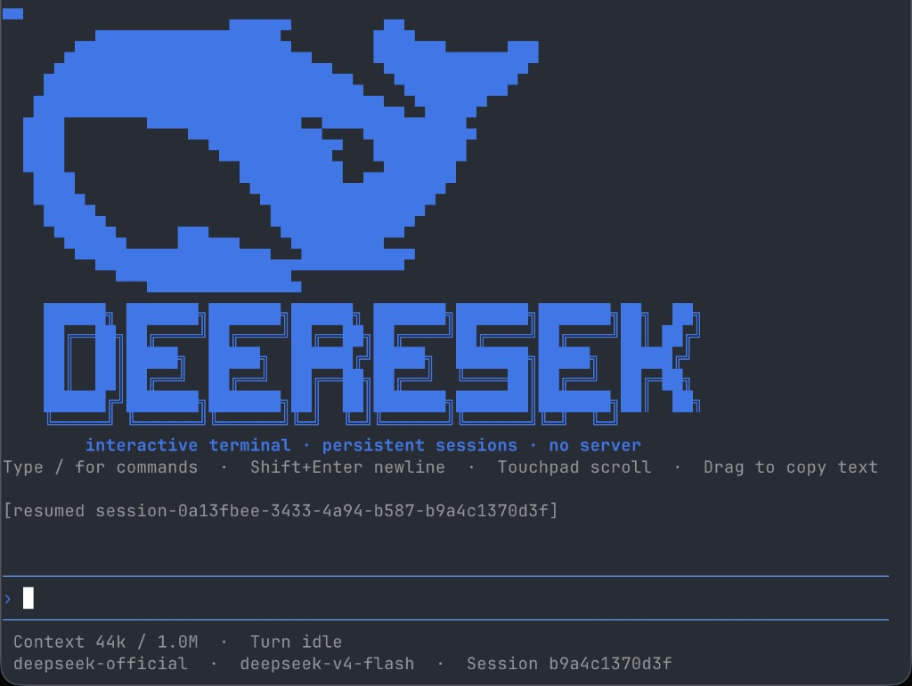
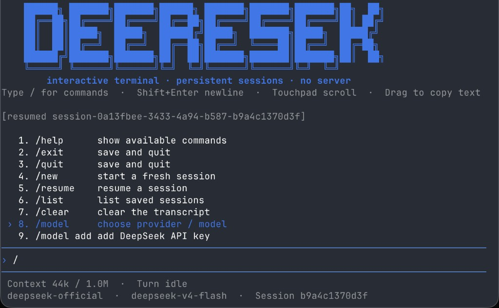

# dsh-cli

一个轻量、顺手、可恢复会话的 **DeepSeek Harness 终端 TUI profile**。

它让你不用打开 Web UI，也能在终端里和 DSH coding agent 持续对话：有更舒服的输入框、会话恢复、轻量 Markdown 显示、触控板滚动、拖拽复制，以及新手友好的 `/model add` 模型配置。

> 适合想把 DSH 当成日常命令行 Agent 使用的人。



## 为什么用它

- **终端原生**：不启动 Web 服务，不监听端口，直接在终端里使用 DSH。
- **会话可恢复**：自动恢复当前目录最近会话，也可以 `/new` 或 `/resume <id>`。
- **输入更顺手**：支持多行输入、光标移动、选择文本和常用快捷键。
- **长对话可滚动**：触控板/鼠标滚轮浏览历史，停在历史位置时不会被新输出强制拉到底。
- **拖拽即复制**：对话区拖选文本，松开后自动写入剪贴板。
- **新手模型配置**：首次启动没配置 DeepSeek API key 时，会提示用 `/model add` 快速添加。

## 界面预览

输入 `/` 可以查看会话内命令。常用命令包括 `/model`、`/model add`、`/resume`、`/new`、`/compact`。



## 快速开始

前置要求：

- Node.js 22 或更高版本
- DSH CLI `0.1.0-rc.6`
- 一个 DeepSeek API key，或其它 OpenAI 兼容 provider 配置

先安装 DSH CLI：

```bash
npm install --global @deepseek-ai/dsh@0.1.0-rc.6
dsh --version
```

安装本 profile：

```bash
git clone https://github.com/khaosnie/dsh-cli.git dsh-cli
cd dsh-cli
npm ci

mkdir -p ~/.dsh/profiles
ln -s "$PWD" ~/.dsh/profiles/cli
```

启动：

```bash
dsh --profile cli
```

如果想使用短命令 `dsh cli`，可以在自己的 shell 配置里加：

```bash
dsh() {
  if [ "$1" = "cli" ]; then
    shift
    command dsh --profile cli "$@"
  else
    command dsh "$@"
  fi
}
```

## 第一次配置模型

dsh-cli 提供两种配置方式。

### 最简单：TUI 里添加 DeepSeek

启动后输入：

```text
/model add
```

然后粘贴你的 DeepSeek API key。输入会被遮罩，不会写入对话 transcript；key 会保存到 DSH 本地 credentials。

如果启动时检测到当前使用 DeepSeek 默认模型但还没有配置 `DEEPSEEK_API_KEY`，TUI 会在启动区提示：

```text
[model setup] No DeepSeek API key detected. Run /model add to add one.
```

### 高级：手动配置其它模型

其它 provider 或代理网关走 DSH 的用户配置。

```bash
export OPENAI_API_KEY="<your-api-key>"
```

```yaml
# ~/.dsh/settings.yaml
agent-default-model:
  provider: openai-compatible
  model: your-model-id
llm-pi-ai:
  providers:
    openai-compatible:
      displayName: OpenAI Compatible
      apiKeyEnv: OPENAI_API_KEY
      api: openai-completions
      baseURL: https://example.com/v1
      models:
        - id: your-model-id
          name: Your Model
          contextWindow: 65536
          maxTokens: 4096
```

进入 TUI 后可以用 `/model` 查看和选择当前可用模型。

## 常用命令

```text
/exit                    保存并退出
/new                     开始新会话
/resume                  查看最近会话
/resume <id>             恢复指定会话
/list                    列出当前项目会话
/clear                   清空当前屏幕
/model                   选择 provider / model
/model add               添加 DeepSeek API key
/model <name> [effort]   切换默认模型
/compact                 压缩上下文
```

## 快捷操作

| 操作 | 说明 |
| --- | --- |
| `Enter` | 发送消息 |
| `Shift+Enter` | 输入换行 |
| `←` / `→` | 移动输入框光标 |
| `Home` / `End` | 移动到行首/行尾 |
| 触控板/鼠标滚轮 | 滚动历史 |
| 拖拽对话文本 | 松开后自动复制 |
| `/` | 打开命令候选 |

## 平台支持

目前主要在 macOS 的终端环境中使用和验证。Linux / WSL 理论上可以运行，但还没有系统测试；Windows 原生终端暂未验证。

不同终端对键盘、鼠标和剪贴板能力的支持不完全一致，如果遇到交互差异，欢迎反馈具体系统和终端应用。

## 安全边界

本 profile 会加载 DSH code runtime，并允许通过 `DSH_TOOLS_MODE` 等 DSH 配置启用工具能力。

请注意：

- 只在可信工作区运行。
- 工具能力配置和文件系统 sandbox 是两套不同边界，启用工具前应分别确认。
- 不要把 API key、访问令牌、私钥或会话日志放进项目工作区。
- 工具输入和输出会写入 DSH 持久会话；开源反馈和 issue 中不要粘贴敏感日志。

## 开发

```bash
npm run check
```

该命令包含语法检查和纯函数单测，不会启动 agent，也不会改动本机会话。

## License

[MIT](LICENSE)
